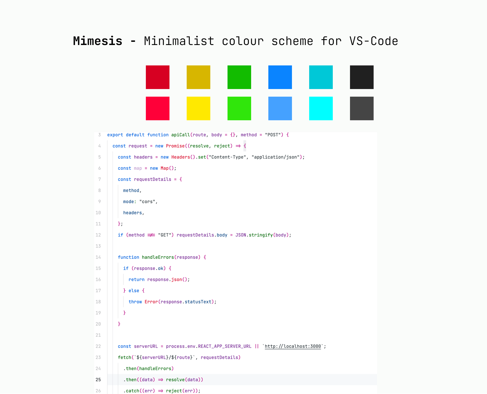

# Mimesis 
Color scheme for Visual Studio Code (VSCode) is a light theme that offers a clean and elegant look.

It features a combination of minimal and vibrant colors, including shades of blue, magenta, green, and gray. The theme provides good contrast between the background and text, making it easy to read and navigate through code. It also supports a variety of file types, including :
- JavaScript
- HTML/CSS
- Python
- PHP
- Rust
- Go

Mimesis color scheme is well-suited for those who prefer a light and minimalist design for their coding environment.

**Enjoy!**
